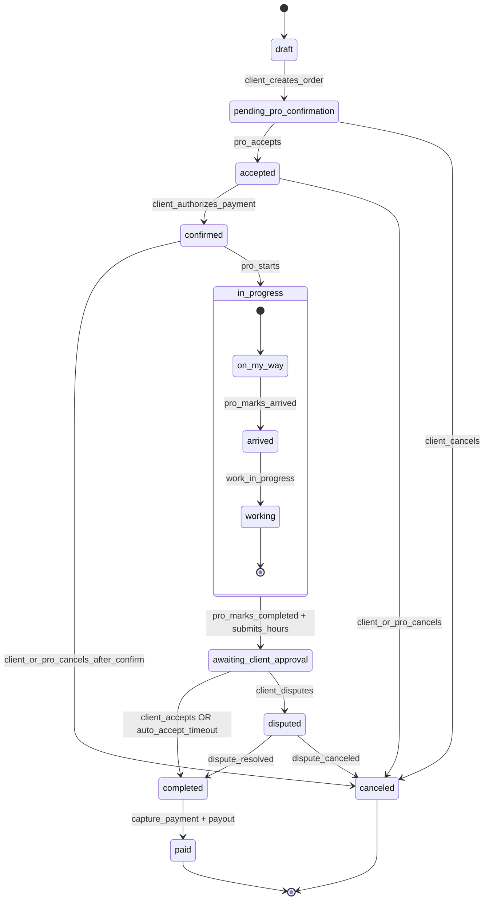

# Order Flow – Hourly-only MVP (EncuentraYa)

This document defines the **end-to-end order lifecycle** for the hourly-only MVP.
It is the canonical reference for **backend state machine, payments, and client/pro actions**.

---

## Scope

- Pricing model: **hourly only**
- Hourly rate is **set by the professional**
- Client selects a professional explicitly
- Payment is **authorized (pre-auth) and later captured**
- Includes **Arrived** tracking
- One core entity: **Order**

---

## High-level flow

1. Client searches categories/subcategories
2. Client selects a professional and creates an order request
3. Professional accepts or declines
4. Client authorizes payment (hourly cap)
5. Order is confirmed
6. Professional executes the job (on-my-way → arrived → work)
7. Professional submits final hours
8. Client accepts or disputes hours
9. Payment is captured
10. Professional is paid out

---

## Detailed flow

### 1) Order creation (client)

Client provides:

- Category / subcategory
- Selected professional
- Address
- Preferred time window
- Description + optional photos

**Order status:** `pending_pro_confirmation`

At this point:

- No payment is authorized
- No calendar is locked
- Pro has not committed yet

---

### 2) Professional decision

Professional can:

- ✅ Accept
- ❌ Decline
- 💬 Ask clarifying questions (via chat)

If declined:

- Order remains open
- Client can select another recommended professional

If accepted:

- Professional commits to the job (soft commitment)

**Order status:** `accepted`

---

### 3) Estimated hours & payment authorization (client)

Client:

- Selects `estimated_hours` (e.g. 1–8 hours)
- Reviews:
  - Hourly rate
  - Cancellation rules
  - Authorization cap

Platform authorizes payment:

```
authorized_amount = hourly_rate * estimated_hours
```

> Money is **authorized, not captured**.

**Order status:** `confirmed`

This is the **hard commitment boundary**:

- Time is locked
- Cancellation rules apply
- Professional knows the job is real

---

### 4) Job execution (professional)

Professional progress updates:

- Marks **“On my way”**
- Marks **“Arrived”**
- Performs the work

**Order status:** `in_progress`

These steps are important for:

- No-show disputes
- Cancellation enforcement
- Trust signals

---

### 5) Job completion & hour submission

Professional:

- Marks **“Completed”**
- Submits `final_hours`

**Order status:** `awaiting_client_approval`

---

### 6) Client approval or dispute

Client can:

- ✅ Accept submitted hours
- ⚠️ Dispute hours (with reason)

Rules:

- If client does not respond within a timeout (e.g. 24h), hours are **auto-approved**

If accepted:

- Payment is captured
- Platform fee is applied
- Payout is scheduled

If disputed:

- Order enters dispute flow
- Capture is paused until resolution

---

### 7) Payment capture & payout

On acceptance:

```
captured_amount = final_hours * hourly_rate
```

Then:

- Platform fee deducted
- Remaining amount paid to professional

**Order status:** `completed` → `paid`

---

## Cancellation rules (MVP)

- Client cancels **before pro accepts**:
  - No charge
- Client cancels **after confirmation**:
  - Charge up to 1 hour (from authorized amount)
- Professional cancels after confirmation:
  - Client not charged
  - Professional reliability score impacted

---

## Order State Machine

### States

- `draft`
- `pending_pro_confirmation`
- `accepted`
- `confirmed`
- `in_progress`
- `awaiting_client_approval`
- `completed`
- `paid`
- `canceled`
- `disputed`

---

### Transition list

- `draft` → `pending_pro_confirmation`
- `pending_pro_confirmation` → `accepted` | `canceled`
- `accepted` → `confirmed` | `canceled`
- `confirmed` → `in_progress` | `canceled`
- `in_progress` → `awaiting_client_approval`
- `awaiting_client_approval` → `completed` | `disputed`
- `completed` → `paid`
- `disputed` → `completed` | `canceled`

---

## Mermaid state diagram



---

## Key invariants

- Payment authorization happens **only after professional acceptance**
- Capture happens **only after client approval (or auto-approval)**
- Hourly rate is **snapshotted** at acceptance time (to avoid retroactive changes)
- One Order owns:
  - lifecycle
  - payment
  - messages
  - reviews

---

## Non-goals (MVP)

- No bidding
- No fixed-price quotes
- No multi-pro competition per order
- No calendar slot booking independent of orders
